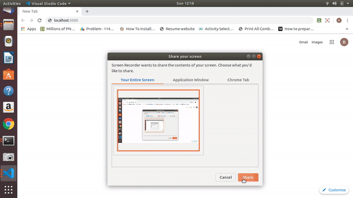
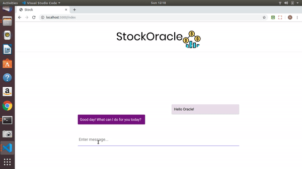

<div align="center">
  </img>
  
 # StockOracle Bot
 
 [](https://www.python.org/)
 
 <br>
 
</div> 


--------
> When it comes to investing in stocks, it is important that the investor is capable of conducting a thorough technical analysis of stock charts. Technical analysis is a term used to define the process of forecasting future price movements based on the past price movements within stock charts. It is with the help of technical analysis that investors are able to make financial decisions of buying, holding, or selling stocks.

> Although technical analysis doesn’t make accurate predictions, it helps investors anticipate the future. Let’s say if a person is willing to invest in a stock, they will first select a stock and analyze its past price fluctuations to see whether it will offer fruitful results in the future or not
The purpose of technical analysis is to help the investor make a more financially sound investment decision. The price is the key to success in stock market investment. The supply and demand of stocks all depend upon technical analysis. By evaluating the history of stock prices, you get a future reading of what a particular stock would be priced at.


-----------------------------------------------

## Webapp
<div align="center">
  </img>
  <br>
   </img>
</div>

-----------------------------------------------
  
## Features

- [x] Chatbot for User friendly interaction.
- [x] Linear Regression to predict future prices.

-----------------------------------------------

## Future Enhancements
- [ ] Improve responsiveness.
- [ ] PWA with integration of Voice-recognition.
- [ ] Adding Google Assistant.

-----------------------------------------------

## Installations
- Install Dependencies:
    
``` pip3 install -r requirements.txt ```
- Start Server:

``` python3 app.py ```

-----------------------------------------------

## Contributions

 We're are open to `enhancements` & `bug-fixes` :smile: 
 
-----------------------------------------------

## Note 

This project was done under `under 24-hours` from scratch with no preparation

-----------------------------------------------

## Contributors

- [Gayatri Srinivasan](https://github.com/gayatri-01)
- [Amisha Waghela](https://github.com/amisha-w)
- [Rahul Mistry](https://github.com/rahulmistry33)

-----------------------------------------------

This project was a part of KJSCE-HACK'19 - [View Submission](https://devfolio.co/submissions/stockoracle-bot)


 


